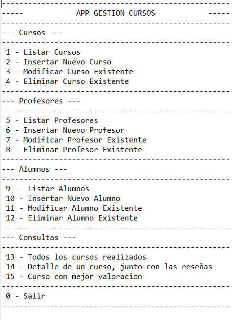
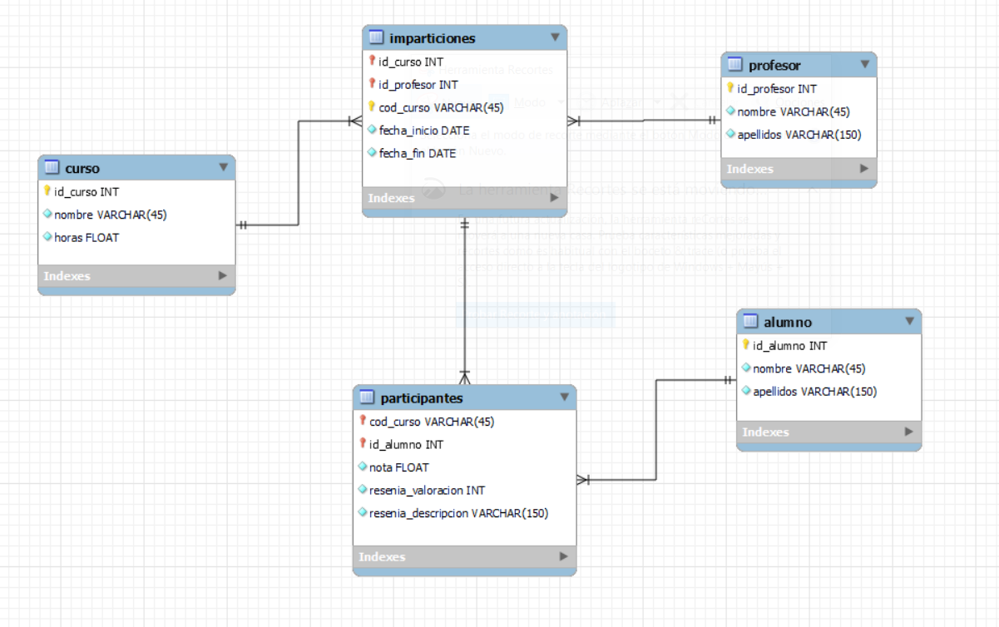

# Proyecto Gestion de Cursos
Proyecto **Java** con bbdd **MySql** para gestionar cursos, profesores y alumnos mediante **APP**

## Descripción

Disponemos de un programa con el que podremos gestionar (realizando CRUD) cursos, profesores y alumnos, ademas de consultar algunos datos de interes sobre los cursos como: Que cursos hay, la valoracion media de los cursos y el detalle de un curso especifico junto con las reseñas de los alumnos.

Inicialmente se muestra un menu principal, en el que se debera de elegir una de las opciones que son los numeros que aparecen al principio de cada linea numerados del **1 al 15** y el **0** se utiliza para salir del programa

Para las opciones de *Modificar* y *Eliminar* (en cualquiera de sus apartados: cursos, profesores, alumnos), se debe introducir una **id** para elegir sobre que dato de la tabla correspondiente se quiere interactuar.

En los casos de *Insertar*, para **cursos** se introduce un nombre y despues unas horas. Y para **profesores** y **alumnos** se introduce el nombre y despues el/los apellido/s ( no se diferencia entre primer y segundo apellido).

La opcion *Listar* unicamente muestra una lista con los datos disponibles en la tabla correspondiente de la BBDD.

**Menu principal**




## Tecnologías que se han usado

- MySql
- Java 8
- Maven 4.0.0

## Programas utilizados
- MySQL Workbench
- Eclipse IDE 

## Montaje y conexión

Al ser un proyecto JAVA contra una BBDD vamos a necesitar un programa de gestión de BBDD, en este caso he utilizado **MySQL Workbench**.

Un dato a tener en cuenta es tener bien **la url de conexión** con la BBDD, la conexion se especifica en la clase **com.elorrieta.proyectofinal.Conexion**

```
	DriverManager.getConnection(""jdbc:mysql://localhost:3306/mf0226_3?useSSL=false", "root", "root");
```

En el código:
- 3306 se refiere al puerto, debeis cambiar al puerto con el que trabajais en el gestor de BBDD.
- mf0226_3 es el nombre de la BBDD.
- "root" "root", es el nombre y password del gestor de BBDD que utilizamos, debeis cambiarlo al que vosotros usais.

Disponemos de una bbdd en MySql. En este [enlace](https://github.com/IbonJG/Proyecto_final_MF0226_03/blob/main/script_create_database.sql) 
se puede ver y descargar o copiar el script para montar la base de datos en tu programa de gestión. (No contiene datos, las tablas estan vacias)

En este otro [enlace](https://github.com/IbonJG/Proyecto_final_MF0226_03/blob/main/script_create_database_data_nuevo.sql) se puede tambien ver y descargar o copiar el codigo con algunos datos introducidos en las diferentes tablas.

## Diagrama BBDD


A continuación se muestra una imagen con la composicion de la BBDD



## Versiones

La version actual del proyecto es la inicial, **1.0.0**

Intencion de realizar nuevas versiones en el futuro proximo.
